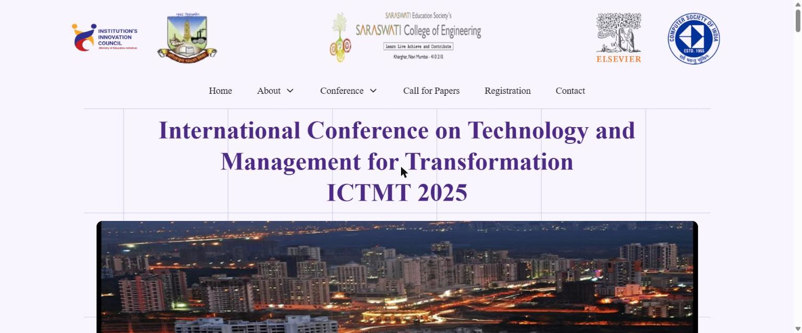
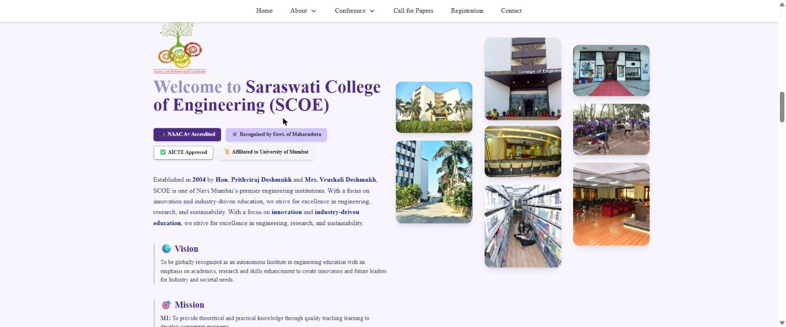
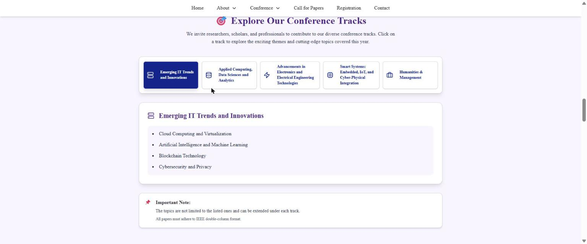
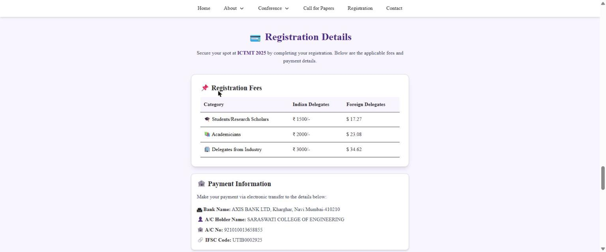

# ICTMT 2025 — Conference Website

The website for **ICTMT 2025**, the International Conference on Technology and Management for
Transformation, organised by Saraswati College of Engineering (SCOE), Kharghar, Navi Mumbai.

<<<<<<< HEAD
It is a single-page React site: everything (conference intro, keynote, tracks, dates, call for
papers, fees, committee) lives on one page, and the navigation scrolls between sections rather than
routing between pages. There is no backend — paper submission goes to Microsoft CMT and
registration payments are made by bank transfer, so the site only has to present the information.

| Landing — supporting logos, nav and banner carousel | About SCOE — accreditation, vision/mission, campus photos |
| :-------------------------------------------------: | :-------------------------------------------------------: |
|         |             |
| **Conference tracks — five tabs, topics per track**  | **Registration — fee table and bank transfer details**    |
|     |         |

## Conference details on the site
=======


## International Conference on Technology, Mathematics, and Teaching 2025

### ✨ Platform Preview

<table>
<tr>
<td width="50%">

<p align="center"><b>Landing Page</b></p>
</td>

<td width="50%">

<p align="center"><b>Conference Program</b></p>
</td>
</tr>

<tr>
<td width="50%">

<p align="center"><b>Speakers</b></p>
</td>

<td width="50%">

<p align="center"><b>Conference Information</b></p>
</td>
</tr>
</table>

[Features](#-key-features) • [Installation](#-installation) • [Documentation](#-project-structure) • [Demo](https://ictmt-2025-conference.vercel.app/)
>>>>>>> 28b43fbf08f31ba59de67fcfb4729fdd66adc84b

- **Date:** 8th April 2025, held online
- **Tracks:** Emerging IT Trends, Applied Computing & Data Science, Electronics & Electrical
  Engineering, Smart Systems (Embedded/IoT/CPS), Humanities & Management
- **Keynote:** Dr. Vasilii Borisov (Ural Federal University) — "Prospects and Applications of
  Artificial Intelligence in Medicine"
- **Submissions:** Microsoft CMT, papers in IEEE double-column format
- **Registration:** ₹1500 (students) / ₹2000 (academicians) / ₹3000 (industry), with USD equivalents
  for foreign delegates

## Stack

- React 19 with Vite 6
- Tailwind CSS v4, wired in through the `@tailwindcss/vite` plugin
- shadcn/ui components (JSX, "new-york" style) built on Radix primitives — dialog/sheet, tabs,
  navigation menu, scroll area, separator, menubar, tooltip
- Framer Motion for entry and float animations, Swiper for the banner carousel
- `react-scroll` for smooth in-page navigation, `react-router-dom` for the single `/` route
- `lucide-react` for icons

## Running it

```bash
npm install
npm run dev       # dev server on http://localhost:5173
npm run build     # production build into dist/
npm run preview   # serve the built output
npm run lint      # eslint
```

## How it is put together

**Content is separated from markup.** Almost all text, dates, names, fees and image imports live in
[`src/assets/values.jsx`](src/assets/values.jsx) as plain exported objects — `conferenceData`,
`scoeContent`, `conferenceTracks`, `timelineData`, `callForPapersData`, `registrationData`,
`patronsData`, `committeeData`, `advisoryCommittees`, plus `menuItems` and `appData` for navigation.
[`src/pages/Home.jsx`](src/pages/Home.jsx) imports those objects and maps over them. To change what
the site says for the next edition, you mostly edit `values.jsx` and not the components.

A few things are still hardcoded in `Home.jsx` rather than in `values.jsx` — notably the keynote
speaker block and the "Committee Members" heading.

**Navigation is scroll-based.** `App.jsx` registers exactly one route (`/` → `Home`). Every menu
entry is a `react-scroll` link pointing at a section `id`: `conference`, `speaker`, `scoe`,
`conference-tracks`, `timeline`, `call-for-paper`, `registration`, `patrons-chairs`, `committee`,
`footer`. `Home.jsx` also reads `location.hash` on mount so a URL like `/#registration` scrolls to
the right place.

**Two separate navigations by breakpoint.** The desktop `Navbar` (with About/Conference dropdowns)
renders only at `lg` and above, and switches from transparent to a white sticky bar once the page is
scrolled past 50px. Below `lg`, a hamburger button opens a Radix `Sheet` drawer built from
`appData.menu`. The row of supporting logos above the nav is hidden below `md`.

### Project structure

```
src/
├── App.jsx                 layout shell: logo row, mobile sheet menu, router, footer
├── main.jsx                entry point
├── index.css               tailwind import + smooth scrolling
├── pages/Home.jsx          every content section of the site
├── components/
│   ├── Navbar.jsx          desktop nav with dropdowns, sticky-on-scroll
│   ├── Footer.jsx          quick links, conference links, contact numbers
│   └── ui/                 shadcn components (button, card, tabs, sheet, …)
├── assets/
│   ├── values.jsx          all site content
│   └── images/             logos, banners, campus photos, portraits
└── lib/utils.js            cn() class-merge helper
```

`@` is aliased to `src/` in both `vite.config.js` and `jsconfig.json`.

## Deploying

`npm run build` produces a static `dist/` folder that can be served from any static host. If you
deploy under a sub-path rather than a domain root, uncomment and set `base` in `vite.config.js`
(there is a commented example left over from a previous conference site).

## Known rough edges

Worth knowing before you work on this:

- `index.html` links a stylesheet called `output.css` that does not exist in the repo — a leftover
  from an earlier Tailwind CLI setup. It 404s harmlessly.
- The site sets `font-['Playfair_Display']` on the main content and navbar, but no webfont is
  actually loaded, so browsers fall back to a default serif.
- `tailwind.config.js` still uses the Tailwind v3 config format, while the project builds with
  Tailwind v4 via the Vite plugin, where configuration is expected in CSS. Its `addVariablesForColors`
  plugin at the bottom of the file references `flattenColorPalette` and `React` without importing
  either, so that part is dead code.
- `src/index.css` has both `@import "tailwindcss"` (v4) and the older `@tailwind base/components/utilities`
  directives.
- Section positioning in the SCOE and timeline sections relies on hand-tuned absolute offsets, so
  layout there is sensitive to content-length changes.

## Credits

Built for Saraswati College of Engineering, Navi Mumbai (<https://www.sce.edu.in>).
Developed by [Hamza Khan](https://github.com/hamzakhan0712).

Licensed under ISC.
